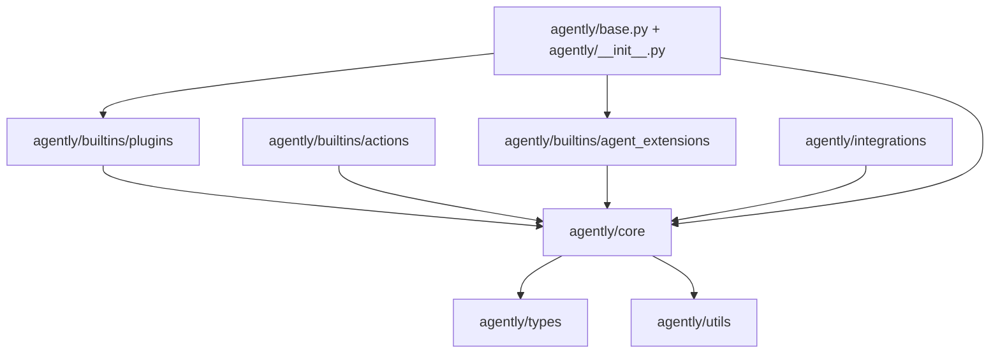

# Agently 边界地图

## 1. 依赖方向



规范方向：

```text
Core contract
  -> plugin/provider implementation
  -> built-in capability Action
  -> Agent extension / facade
  -> business application
```

## 2. 顶层职责

| 路径 | 职责 |
|------|------|
| `agently/core/model` | Prompt、ModelRequest、ModelResponse 与解析结果 |
| `agently/core/execution` | Action、环境、审批和执行边界 |
| `agently/core/orchestration` | TriggerFlow、Dynamic Task、DAG |
| `agently/core/application` | Agent execution、AgentTask、Skills |
| `agently/core/runtime` | RunContext、事件、attempt 执行 |
| `agently/core/session` | Session、Recall、Workspace |
| `agently/core/extension` | PluginManager 与 extension handlers |
| `agently/builtins/plugins` | Core 契约的默认实现 |
| `agently/builtins/agent_extensions` | 面向 Agent 用户的便利能力 |
| `agently/base.py` | 全局装配和 `AgentlyMain` 门面 |

## 3. import 时的全局装配

`agently/base.py` 创建：

- 全局 `Settings`
- `PluginManager`
- `EventCenter`
- `Action`
- `ExecutionEnvironmentManager`
- `PolicyApprovalManager`
- `SkillsExecutor`
- `WorkspaceManager`

`agently/__init__.py` 再创建单例：

```python
Agently = AgentlyMain()
```

## 4. Public API

| 分类 | 符号 | 定义 |
|------|------|------|
| 门面 | `Agently` | `agently/__init__.py` |
| Agent | `Agent` | `agently/base.py` |
| 请求 | `ModelRequest` | `agently/core/model/ModelRequest.py` |
| 响应 | `ModelResponse` | `agently/core/model/ModelResponse.py` |
| 工作流 | `TriggerFlow` | `agently/core/orchestration/TriggerFlow/TriggerFlow.py` |
| 应用任务 | `AgentTask` | `agently/core/application/AgentTask/` |

## 5. 扩展点定位

| 需求 | 主要扩展点 |
|------|------------|
| 新模型协议 | `ModelRequester` plugin |
| 新响应格式 | `ResponseParser` plugin |
| 新 Prompt 渲染 | `PromptGenerator` plugin |
| 新原子能力后端 | `ActionExecutor` plugin |
| 新长期资源 | `ExecutionEnvironmentProvider` plugin |
| 新 Action 循环 | `ActionRuntime` plugin |
| 新 Agent 场景语法 | `builtins/agent_extensions` |

## 6. 定位练习

| 符号 | 预测路径 | 实际路径 | 耗时 |
|------|----------|----------|------|
| `AgentTurn` | | | |
| `ActionDispatcher` | | | |
| `TriggerFlowExecution` | | | |
| `OpenAICompatible` | | | |
| `ExecutionEnvironmentManager` | | | |

